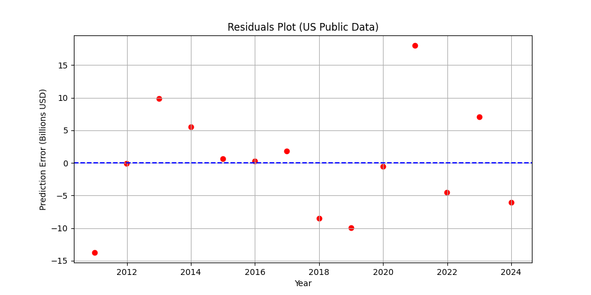

# war Fi

This repository contains a small Python projection of
military‑spending data.  It builds a very simple linear‑regression
model from real-world United States historical time‑series data (2010-2023) 
and then uses that model together with a few other trends to produce a 
2025 “military simulation” report.

The Final primary script is `wfi.py` ; the file is
self‑contained and does not read or write any external data.

## What it does

1. **Load historical data**  
   Creates a `pandas.DataFrame` with 14 years of real-world US public data for:
    These values can be customised for personal uses
   * GDP per capita (USD),
   * military spending as a percentage of GDP,
   * US inflation rate (%),
   * US Foreign Military Aid (Billions USD),
   * total military spending (USD),
   * number of troops, active fighters, nuclear submarines, carriers, etc.

2. **Fit a model**  
   A `sklearn.linear_model.LinearRegression` is trained to predict
   `military_spending_bn_usd` from `gdp_per_capita_usd`, `military_pct_gdp`, 
   `inflation_rate_pct`, and `foreign_military_aid_bn`.  The R² score is 
   printed and a residuals plot is saved to check for systematic errors.

   

3. **Interactive 2025 Parameters (What-If Scenarios)**  
   Future 2025 economic values are dynamically projected using historical data.
   However, the script will pause and **prompt you in the terminal** to enter your own 
   custom values for GDP, Inflation, or Military Aid (if desired). If you 
   just press `[Enter]`, it will automatically use the calculated historical trend.

4. **Project other quantities**  
   Compound annual growth rates (CAGR) are computed for troops, fighters,
   subs and carriers based on the historical series; those rates are then
   applied to the latest values to project two years ahead (for 2025).

5. **Apply Attrition Models (Personnel Reduction)**  
   To accurately project the Net Active Personnel (anchored near the USA's active
   ~1.87 million personnel figure), the projected gross army strength is reduced by 
   estimated annual attrition rates:
   * **5.0%** Retirements/Separations
   * **0.1%** Natural Expected Mortality
   * **0.02%** Training Exercise Casualties

6. **Print Results**  
   The script prints the interactive what-if simulation output in the terminal,
   including projected counts (with attrition deducted) and a derived 
   “military efficiency” metric.
   
```text
==================================================
INTERACTIVE MILITARY BUDGET SIMULATOR (2025)
==================================================
Enter your own estimates for 2025 to see how the budget reacts.
Press [ENTER] to skip and just use the natural historical trend.

Estimated GDP Per Capita in USD (Default: 88427.91): 
Military Spending as % of GDP (Default: 3.21): 4.5
Estimated Inflation Rate (%) (Default: 4.74): 3.0
Foreign Military Aid (Billions USD) (Default: 64.64): 18.0
```


## Requirements

The script was developed with Python 3.7+ and depends on the following
libraries:

* `pandas`
* `numpy`
* `matplotlib`
* `scikit-learn`

Install them into your chosen interpreter/venv before running the
program:

```bash
pip install --upgrade pandas numpy matplotlib scikit-learn
# or, on macOS with the system python:
# pip3 install --upgrade pandas numpy matplotlib scikit-learn